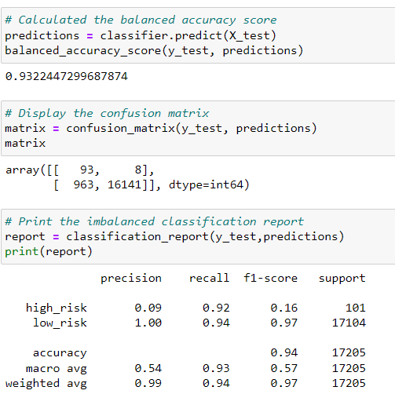

# Credit_Risk_Analysis

## Overview
This project is designed to find the best model to determine credit risk. Using the concept of Supervised Machine Learning and the classes: imbalanced-learn and scikit-learn, I am building and evaluating models that can be used to determine the credit risk using resampling. 

The data is trained from credit card credit dataset from LendingClub, a peer-to-peer lending services company. The following supervised machine learning models will be used:
- RandomOverSampler
- SMOTE 
- ClusterCentroids
- SMOTEENN
- BalancedRandomForestClassifier
- EasyEnsembleClassifier

The first 3 is a focus on oversampling data, followed by an over- and undersampling appraoch with SMOTEEN and finally the last 2 reduce bias.

To reduce variability over testing data, I used a consistent random_state of 1, which can easily be changed later on to train the models further.

## Results

Using the RandomOverSampler model, we see that the balanced accuracy score is approximately 65%.
The model's high_risk report shows a precision score of 0.01 and recall(sensitivity) of 0.71.
The model's low_risk report shows a precision score of 1.00 and recall(sensitivity) 0.58.

Using the SMOTE model, we see that the balanced accuracy score is approximately 66%.
The model's high_risk report shows a precision score of 0.01 and recall(sensitivity) of 0.63.
The model's low_risk report shows a precision score of 1.00 and recall(sensitivity) 0.68.

Using the ClusterCentroids model, we see that the balanced accuracy score is approximately 54%.
The model's high_risk report shows a precision score of 0.01 and recall(sensitivity) of 0.69.
The model's low_risk report shows a precision score of 1.00 and recall(sensitivity) 0.40.

Using the SMOTEENN model, we see that the balanced accuracy score is approximately 65%.
The model's high_risk report shows a precision score of 0.01 and recall(sensitivity) of 0.72.
The model's low_risk report shows a precision score of 1.00 and recall(sensitivity) 0.57.

Using the BalancedRandomForest model, we see that the balanced accuracy score is approximately 65%.
The model's high_risk report shows a precision score of 0.03 and recall(sensitivity) of 0.70.
The model's low_risk report shows a precision score of 1.00 and recall(sensitivity) 0.87.

Using the EasyEnsemble model, we see that the balanced accuracy score is approximately 93%.
The model's high_risk report shows a precision score of 0.09 and recall(sensitivity) of 0.92.
The model's low_risk report shows a precision score of 1.00 and recall(sensitivity) 0.94.

## Summary
The main thing to keep in mind when determining credit risk is to assess the importance of precision and sensitivity. Each are important in its own right, but it would help to assess model better with a clearer understanding of these values.

The precision is the measurement of how reliable our model is in flagging the high risk credit. The low precision is indicative of a large number of false positives (people who are low risk but flagged as high risk).

The sensitivity is the ability to find all positive samples. A low sensitivity indicates a large amounts of false negatives (people who are high risk but incorrectly considered low risk).

Considering what is on the line, it makes much more sense to aim for a higher sensitivity (recall) score as thais means that are more accurately catching the high risk credit. It is okay if we have more false positives as those can be dealt with on individual levels. However, if we approve loans for people with high risk, that will bring far more negative consequences.

That being said, the best model that we have with the highest sensitivity is easyEnsemble with an accuracy of 93%, sensitivity of .92 (high_risk), and .94 (low_risk). Coincidentally, it also has the highest precision of high risk at 0.09. This means that this model is the best to capture as many high risk credits as possible and is able to catch as many of them accurately without giving many false negatives.